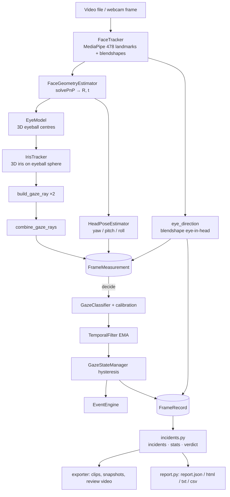
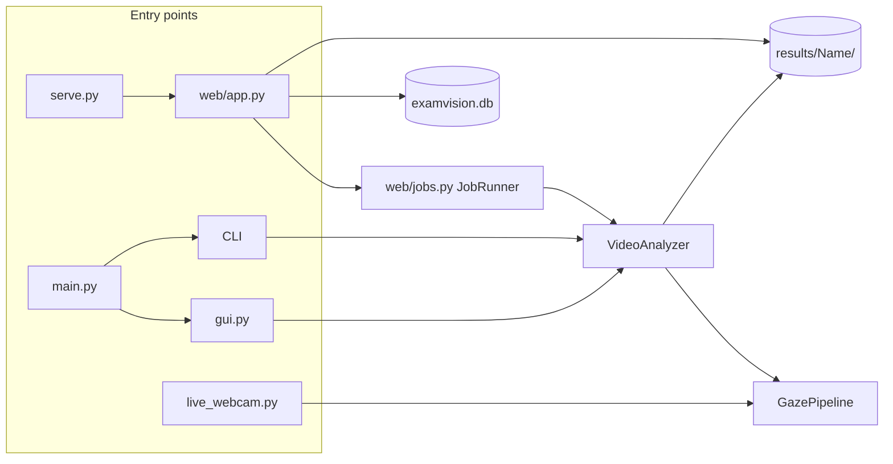
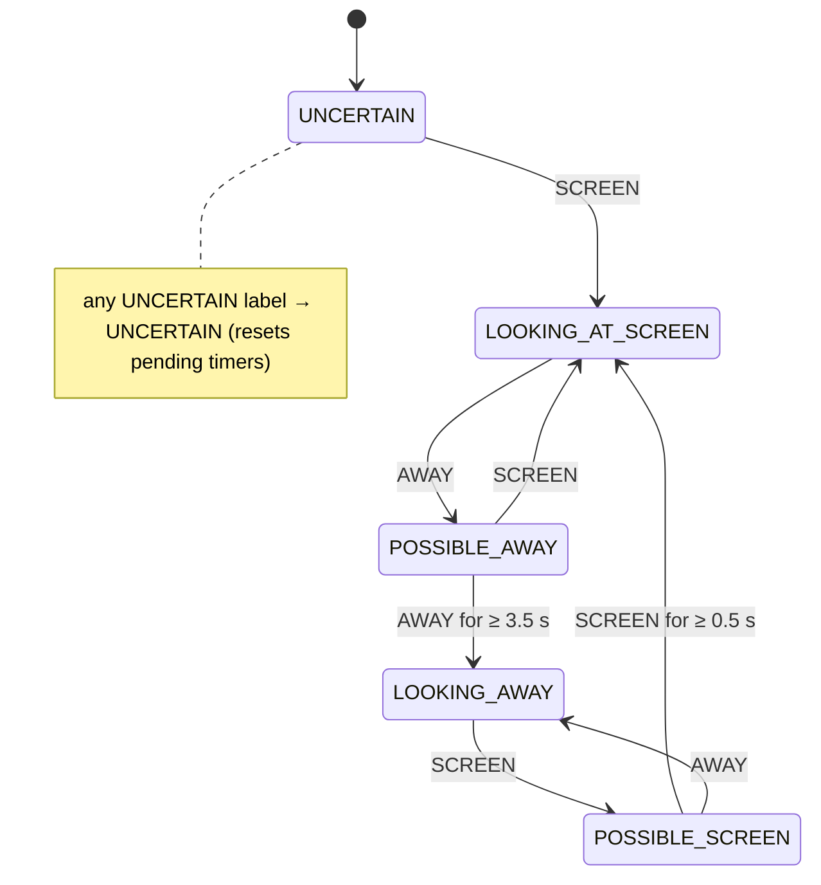
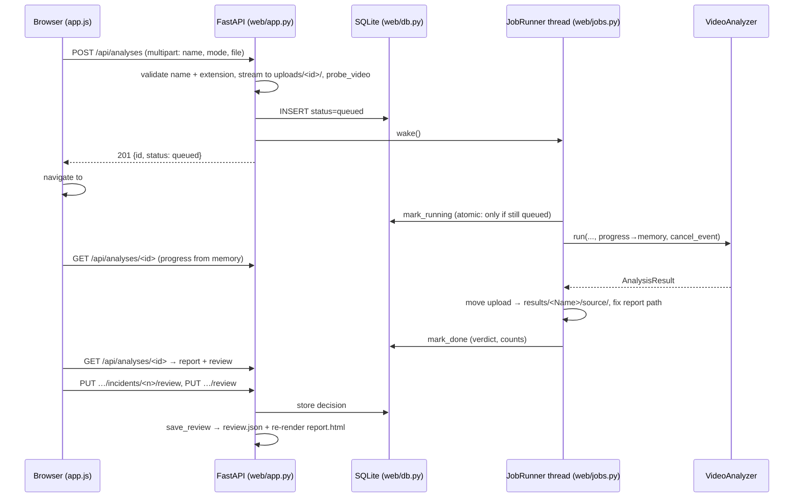

# ExamVision Developer Handbook

> Audience: developers who will maintain or extend ExamVision.
> Scope: every module in the repository, the core algorithms, how the
> pieces connect, why they are built the way they are, and how to change
> them safely.
>
> Code references use `path/file.py → Symbol`. All paths are relative to
> the project folder `examvision/`.

---

## Contents

1. [What ExamVision is](#1-what-examvision-is)
2. [Setup and ways to run it](#2-setup-and-ways-to-run-it)
3. [Repository map](#3-repository-map)
4. [Architecture at a glance](#4-architecture-at-a-glance)
5. [Coordinate systems and units](#5-coordinate-systems-and-units)
6. [Stage 1 — Per-frame measurement](#6-stage-1--per-frame-measurement)
7. [Stage 2 — Per-frame decision](#7-stage-2--per-frame-decision)
8. [Calibration: live 9-point and automatic](#8-calibration-live-9-point-and-automatic)
9. [Video analysis orchestration](#9-video-analysis-orchestration)
10. [Incidents, statistics and the verdict](#10-incidents-statistics-and-the-verdict)
11. [Evidence export: clips, snapshots, review video](#11-evidence-export-clips-snapshots-review-video)
12. [Reports and data files](#12-reports-and-data-files)
13. [Web application — backend](#13-web-application--backend)
14. [Web application — frontend](#14-web-application--frontend)
15. [Settings system](#15-settings-system)
16. [Other entry points](#16-other-entry-points)
17. [Configuration reference](#17-configuration-reference)
18. [Testing](#18-testing)
19. [Design history: bugs found and lessons learned](#19-design-history-bugs-found-and-lessons-learned)
20. [Known limitations](#20-known-limitations)
21. [How to extend ExamVision](#21-how-to-extend-examvision)
22. [Troubleshooting](#22-troubleshooting)
23. [Glossary](#23-glossary)

---

## 1. What ExamVision is

ExamVision analyzes a **recorded exam video** of a candidate taken by the
webcam of the computer the exam was taken on. It decides, frame by frame,
whether the candidate is looking at the screen. It then turns sustained
"not looking" periods into timestamped **incidents** and gives an automatic
verdict: **CHEATING**, **NO CHEATING** or **INCONCLUSIVE**. A human
reviewer confirms or dismisses each incident in a web UI and records the
final decision.

What it deliberately does **not** do:

- It detects no objects (phones, books) and does no identity checks or
  audio analysis. The only signal is *where the candidate is looking*.
- It does not make a final disciplinary decision. The automatic verdict
  is a screening result, and a reviewer decides.
- It uses no cloud service. Everything runs locally. The only network
  access is a one-time download of the MediaPipe face model, plus the
  optional Google Font in the web UI.

Five products share one engine:

| Entry point | What it is |
|---|---|
| `serve.py` | **Web application** (main product): upload, queue, review, decide |
| `main.py` | Desktop app (Tkinter) / command-line analysis |
| `live_webcam.py` | The original real-time webcam mode, now only used to create a personal calibration |
| `repair_videos.py` | Maintenance: convert result videos to browser-playable H.264 |
| `tests/` | 63 automated tests |

---

## 2. Setup and ways to run it

### Environment

- **Python 3.14** in the project's own virtual environment `venv/`.
- Dependencies are in `requirements.txt`: `opencv-python`, `mediapipe`
  (Tasks API), `numpy`, `av` (PyAV, for H.264), `fastapi`,
  `uvicorn[standard]`, `python-multipart`, and `pytest`/`httpx` for tests.

```powershell
cd examvision
python -m venv venv                       # once
.\venv\Scripts\python.exe -m pip install -r requirements.txt
```

> **Always run with `venv\Scripts\python.exe`.** The system Python on the
> development machine has most packages but **not PyAV**. Without PyAV,
> videos silently came out in a format browsers cannot play. `serve.py →
> check_environment()` now refuses to start in such an interpreter, and
> `.vscode/settings.json` points VS Code at the venv.

### Running

```powershell
.\venv\Scripts\python.exe serve.py                      # web app on http://127.0.0.1:8000
.\venv\Scripts\python.exe serve.py --host 0.0.0.0       # reachable on the LAN (no login!)
.\venv\Scripts\python.exe main.py                       # desktop app
.\venv\Scripts\python.exe main.py --name "Ali Khan" --video exam.mp4   # CLI
.\venv\Scripts\python.exe live_webcam.py                # live mode / create calibration
.\venv\Scripts\python.exe repair_videos.py --dry-run    # check result videos
.\venv\Scripts\python.exe -m pytest tests -q            # tests
```

On first use, `face/face_tracker.py → _ensure_model()` downloads
`face_landmarker.task` (a few MB) to `~/.cache/examvision/`. Later runs
are offline.

---

## 3. Repository map

```
examvision/
├── config.py                 All tunable constants (dataclasses) — single source of defaults
├── settings_store.py         settings.json overrides (web Settings page) on top of config.py
├── pipeline.py               GazePipeline: per-frame measure() + decide() — shared by all modes
│
├── face/
│   ├── face_tracker.py       MediaPipe FaceLandmarker wrapper (only file importing mediapipe)
│   ├── face_geometry.py      solvePnP on 6 stable landmarks → FacePose (R, t)
│   └── head_pose.py          R → yaw/pitch/roll (viewer-frame decomposition)
├── gaze/
│   ├── eye_model.py          3D eyeball centres as fixed offsets in the face frame
│   ├── iris_tracker.py       iris 2D centre + validity → ray/sphere unprojection → 3D iris
│   ├── gaze_ray.py           GazeRay(origin, direction, confidence)
│   ├── binocular_gaze.py     combine left/right rays (+ disagreement penalty)
│   ├── screen_plane.py       ray/plane intersection
│   ├── calibration.py        CalibrationManager (9-point fit, save/load)
│   ├── gaze_classifier.py    single-frame fusion → SCREEN / AWAY / UNCERTAIN
│   └── eye_direction.py      MediaPipe blendshapes → eye-in-head direction (no calibration)
├── proctoring/
│   ├── temporal_filter.py    EMA smoothing of screen position + confidence
│   ├── state_manager.py      hysteresis state machine (LOOKING_AT_SCREEN ⇄ LOOKING_AWAY)
│   └── event_engine.py       discrete events (LOOKING_AWAY_STARTED, FACE_LOST, …)
├── video_analysis/
│   ├── video_source.py       probe + frame reader with media timestamps
│   ├── auto_calibration.py   locate the screen from the video itself
│   ├── analyzer.py           VideoAnalyzer: the 5-step orchestration
│   ├── incidents.py          FrameRecord → incidents, stats, verdict (pure functions)
│   ├── exporter.py           clips, snapshots, review video (one sequential pass)
│   ├── video_writer.py       H.264 writer (PyAV) with OpenCV fallback
│   ├── output_layout.py      name validation, results/<Name>/ folder creation
│   └── report.py             report.json/html/txt/csv, data files, review re-rendering
├── web/
│   ├── app.py                FastAPI app: JSON API + static UI + file serving
│   ├── db.py                 SQLite store (analyses, incident_reviews)
│   ├── jobs.py               background worker queue + results-folder import
│   └── static/               index.html, app.js, styles.css (no build step)
├── camera/camera_manager.py  webcam capture (live mode only)
├── visualization/overlay.py  OpenCV debug overlay (live mode only)
├── proctor_logging/          CSV/JSON session logger (live mode only)
├── gui.py                    Tkinter desktop front end
├── main.py                   CLI / desktop entry
├── serve.py                  web entry + environment check
├── live_webcam.py            live webcam mode
├── repair_videos.py          re-encode result videos to H.264
├── tests/                    pytest suites (see §18)
├── results/                  OUTPUT: one folder per analysis (see §12)
├── uploads/                  web uploads waiting to be analyzed (transient)
├── examvision.db             web app database (created on first start)
├── settings.json             saved Settings-page overrides (created when saved)
└── calibration_data.json     saved live-mode calibration (optional)
```

Folder naming note: the logger package is `proctor_logging/`, not
`logging/`. A local `logging` package would shadow Python's standard
library module, which MediaPipe uses internally.

---

## 4. Architecture at a glance

### The layered engine



### The two-stage split (key design decision)

`pipeline.py → GazePipeline` separates per-frame work into two stages:

| Stage | Method | Depends on | Stateful? |
|---|---|---|---|
| **Measure** | `measure(frame, t, timestamp_ms)` | the pixels only | only MediaPipe's tracker |
| **Decide** | `decide(measurement, t)` | calibration + time | EMA, state machine, events |

- **Live mode** calls `measure` then `decide` for each frame.
- **Video mode** runs `measure` over the whole file first, then fits a
  calibration from those measurements, then replays `decide` over them.
  A recorded video has no calibration dots, and the calibration needs to
  see the whole video. Because both modes use the same `decide()`, the
  classification and hysteresis logic is identical.

### How the products share the engine



---

## 5. Coordinate systems and units

The frames are never mixed; every function states which one it uses.

| Frame | Definition | Used by |
|---|---|---|
| **Image** | pixels (u, v), origin top-left | landmarks, overlays |
| **Camera** | OpenCV: X right, Y **down**, Z forward from the lens | eye centres, iris, gaze rays, screen plane |
| **Face model** | rigid head frame, origin at nose tip, X right, Y **up**, Z toward the viewer (`config.FACE_MODEL_3D`) | solvePnP target; eye-centre offsets |
| **Viewer** | camera frame with Y and Z flipped (`diag(1,−1,−1)`) | head-pose Euler angles (frontal face = 0,0,0) |
| **Plane (u, v)** | 2D coordinates on the assumed screen plane, `v` = up | intermediate for calibration |
| **Normalized screen (sx, sy)** | calibrated, screen edges at ±1, y up | classification |
| **Video time** | seconds from the start of the file (media timestamps) | everything temporal in video mode |

**Units.** The face model is in *model units*, a generic scale about 5× a
millimetre (interocular outer corners are 450 units, about 90 mm on a
real face). A face 60 cm from the camera therefore sits at z ≈ 3000
units. The model-unit scale is arbitrary; only ratios and angles are
meaningful. That is why disagreement and screen size are expressed as
**angles** (see §6.6, §8.2). Durations are seconds and angles are degrees
unless a name says `_rad`.

**Directions in reports** are *as seen in the video* (camera view). With
an unmirrored webcam, the candidate's own left appears on the image's
right.

---

## 6. Stage 1 — Per-frame measurement

Entry: `pipeline.py → GazePipeline.measure()` → `FrameMeasurement`.

### 6.1 Face tracking — `face/face_tracker.py`

- Wraps **MediaPipe FaceLandmarker (Tasks API)** in `RunningMode.VIDEO`,
  with `num_faces=2` and `output_face_blendshapes=True`.
- The legacy `mp.solutions.face_mesh` was removed from mediapipe
  0.10.30+. This file is the **only** mediapipe import, so the landmark
  backend can be swapped here.
- **Timestamps.** VIDEO mode requires strictly increasing timestamps.
  `process(frame_rgb, timestamp_ms=None)` uses the frame's **media time**
  when given (video files) and wall-clock time otherwise (webcam). It
  bumps equal timestamps by 1 ms.
- Output: `FaceTrackerResult(face_detected, num_faces, faces=[FaceObservation])`.
  Each `FaceObservation` has 478 normalized landmarks (468 mesh + 10 iris),
  the image size, and a `blendshapes` dict (name → score 0..1).
- The pipeline tracks the **highest-confidence face** as the candidate.
  The face count still drives `MULTIPLE_FACES_DETECTED`.

### 6.2 Head pose from stable landmarks — `face/face_geometry.py`

`FaceGeometryEstimator.estimate(face) → FacePose`

- Runs `cv2.solvePnP` on **six stable landmarks** only: nose tip (1),
  chin (152), outer eye corners (33, 263) and mouth corners (61, 291).
  They are matched to a generic 3D face model. Eyelid and iris points are
  **excluded** because they move when the eyes rotate and would bias the
  head pose.
- Intrinsics are approximated: focal length = image width, principal
  point = image centre, no distortion.
- Output: rotation `R` and translation `t` with `X_cam = R·X_model + t`,
  plus a **reprojection error** in pixels that gates trust downstream.

### 6.3 Head angles — `face/head_pose.py`

For a frontal face, solvePnP returns `R = diag(1,−1,−1)` (a 180° flip
about X), not the identity. The estimator therefore first converts to the
viewer frame, `M = diag(1,−1,−1)·R`, then decomposes
`M = Ry(yaw)·Rx(pitch)·Rz(roll)`:

```
pitch = asin(−M[1,2])      yaw = atan2(M[0,2], M[2,2])      roll = atan2(M[1,0], M[1,1])
```

Sign conventions: `yaw > 0` means the head is turned toward the **image
right**, `pitch > 0` means the head is down, and frontal = (0, 0, 0).
(The earlier version mislabeled these axes; see §19.)

### 6.4 Eyeball centres — `gaze/eye_model.py`

Each eyeball centre is a **fixed offset in the face-model frame**: from
the outer eye corner, 67.5 units toward the nose, 20 units back into the
socket and 8 units down. It is transformed to camera coordinates with the
frame's `(R, t)`. Because the offset is fixed in the head, eye rotation
never moves it. That is the point: the centre is decoupled from noisy
eyelid landmarks. The eyeball radius is 60 units.

### 6.5 Iris in 3D — `gaze/iris_tracker.py`

1. **2D centre and validity** use the **4 iris-contour landmarks**
   (`LEFT_IRIS_CONTOUR = 469–472`, `RIGHT_IRIS_CONTOUR = 474–477`).
   Validity = `1 − CV(radii)`, where CV is the coefficient of variation of
   the distances from the centroid. A round, tight contour gives about
   0.9; a closed or occluded eye gives a low value, and anything below
   `min_iris_validity = 0.35` is rejected.
   *Do not include landmark 468/473 (the iris centre).* It sits at radius
   ≈ 0 and caps validity at about 0.5 (§19).
2. **Unprojection.** The camera ray through the 2D centre is intersected
   with a sphere of eyeball radius at the 3D eye centre. The **near**
   intersection is the 3D iris position.

### 6.6 Gaze rays and binocular combination

- `gaze/gaze_ray.py → build_gaze_ray`: `O = eye_centre`,
  `D = normalize(iris − eye_centre)`, confidence = iris validity.
- `gaze/binocular_gaze.py → combine_gaze_rays(left, right, max_disagreement_deg)`:
  - With one valid eye, that ray is used with confidence × 0.7.
  - Direction = confidence-weighted mean of D₁ and D₂, normalized.
  - **Origin = midpoint of the two eye centres** (the "cyclopean eye").
  - **Disagreement penalty**: the closest-approach separation between the
    two lines, expressed as an **angle seen from the camera**
    (`atan(separation / viewing_distance)`). At `max_disagreement_deg`
    (10°) the confidence is halved. Converging rays intersect, so normal
    vergence costs nothing; only skew (mostly vertical noise) is
    penalized.

### 6.7 Eye direction from blendshapes — `gaze/eye_direction.py`

A **second, independent gaze signal**, added after real-footage testing
(§19). MediaPipe's blendshape model outputs, per eye, `eyeLookIn/Out/Up/
Down` and `eyeBlink` scores between 0 and 1.

```
image_right = (eyeLookOutLeft + eyeLookInRight) / 2      # subject looks to their own left
image_left  = (eyeLookInLeft  + eyeLookOutRight) / 2
x    = image_right − image_left          # > 0: eyes toward image right
up   = mean(eyeLookUp*),  down = mean(eyeLookDown*),  blink = mean(eyeBlink*)
```

`v = up − down` is the vertical eye direction (−1 fully down … +1 up).

**Everything is relative to the candidate's own screen position (v1.2).**
A webcam sits *above* the screen, so reading the screen means the eyes
are lowered. How much differs a lot per person and setup: screen reading
measured `v` from −0.33 to +0.11 on the test recordings. Fixed limits and
"eyes centred = screen" both failed on the 'sir' video (§19).

- `fit_eye_baseline(eyes, ac, ic) → EyeBaseline` finds the screen-reading
  eye position. Among roughly-ahead open-eye frames (`|x| ≤ 0.30`,
  `−0.70 ≤ v ≤ 0.45`) it finds the common eye positions
  (`find_eye_clusters`: repeated density peaks, radius 0.12). The largest
  is the screen, **unless another substantial cluster (≥ 25% of the
  largest) sits clearly below it** (more than 0.12 lower, within 0.15
  sideways): then the lower one is the screen and the larger one is
  looking above the screen. With under 15% plausible frames it falls
  back to the densest cluster overall and the report warns.
- `eyes_away_direction(ed, baseline, ic)` measures the deviation from the
  baseline, divides it by per-direction limits (`eye_limit_side` 0.45,
  `eye_limit_up` 0.34, `eye_limit_down` 0.35; tuned 2026-09-30), and flags the frame when
  the result is **outside the unit ellipse** (`gaze/directions.py`). The
  ellipse, unlike separate per-axis checks, catches diagonal looks
  toward a corner. The label is one of eight directions; it is diagonal
  when the smaller component is ≥ 0.6 of the larger.
- Away runs shorter than `eye_min_run_s` (0.4 s) are dropped as
  landmark flicker, so noise cannot stretch an incident's start.
- Blinks (blink ≥ 0.5) are skipped, but `label_eye_frames` turns lids
  held nearly closed for ≥ 1 s into DOWN: looking far down lowers the
  lids so much that MediaPipe reports a blink (~0.75 on 'sir').
- `near_baseline(ed, baseline, ic, 0.5)` selects the frames the
  automatic calibration trusts (§8.2).
- Limits are tuned on labelled videos with `tools/tune_eye_limits.py`
  (§15a).
- Why it exists: these scores need **no calibration** and respond
  strongly to reading notes. On real recordings they measured about 0.1
  on screen, about 0.5–0.75 reading off-screen, and about 0.9 for hard
  sideways glances. The geometric ray moved only about 1.5° between
  those cases.

### 6.8 `FrameMeasurement`

This is what `measure()` returns. The scalar fields are what `decide()`
needs: `timestamp, num_faces, pose_ok, face_confidence,
reprojection_error_px, head_pose, combined_ray, iris_*_valid, eye`. The
heavy fields (`face, pose, eye_centers, left_ray, right_ray`) exist only
for the live overlay. `compact()` drops them, and video mode keeps only
compact measurements (landmarks for an hour of video would take gigabytes).

---

## 7. Stage 2 — Per-frame decision

Entry: `GazePipeline.decide(m, now)` → `FrameDecision(state, gaze_result, smoothed, smoothed_label)`.

```
on_face_count → (no face or no pose? → state UNCERTAIN)
             → GazeClassifier.classify → TemporalFilter.update → smoothed label
             → GazeStateManager.update → EventEngine.on_state
```

### 7.1 Single-frame fusion — `gaze/gaze_classifier.py`

1. Base confidence = face confidence × 0.4 if the pose reprojection error
   is above 12 px.
2. Intersect the combined ray with the calibrated screen plane. An
   invalid intersection gives UNCERTAIN.
3. Apply the calibration's affine → `(sx, sy)`.
4. Gaze confidence = base × ray confidence. Below `min_gaze_confidence`
   (0.4) the frame is UNCERTAIN.
5. **Head pose is supporting evidence only.** Extreme yaw > 45° or
   pitch > 40° multiplies confidence by (1 − 0.25). It can never flip a
   clear eye verdict by itself.
6. Inside `[−1−margin, 1+margin]²` (margin 0.12) gives SCREEN, otherwise
   AWAY. The direction is one of eight (`gaze/directions.py`): each axis
   contributes the part beyond its screen edge, so a point clearly past
   a corner is diagonal (e.g. DOWN-LEFT).

### 7.2 Smoothing — `proctoring/temporal_filter.py`

An EMA (α = 0.25) over `screen_x`, `screen_y` and `confidence`. Discrete
labels are never averaged. The label is re-derived from the smoothed
position each frame. Invalid frames decay the confidence but hold the
position, so a blink does not yank it.

### 7.3 Hysteresis — `proctoring/state_manager.py`



Durations come from `TemporalConfig`. A 200 ms deviation self-cancels. In
video mode `now` is **video time**, so the same seconds apply however
fast the machine processes frames.

### 7.4 Events — `proctoring/event_engine.py`

`LOOKING_AWAY_STARTED/CONTINUED`, `LOOKING_AT_SCREEN_RESUMED`,
`FACE_LOST` (≥ 1.5 s), `MULTIPLE_FACES_DETECTED` (≥ 2 s),
`LOW_GAZE_CONFIDENCE` and `CALIBRATION_FAILED`, each with its own
persistence. Events are **observations, not verdicts**. The video
analyzer writes them to `data/events.json` (without `CONTINUED`, which
fires every frame), but builds incidents from `FrameRecord`s (§10), not
from events.

---

## 8. Calibration: live 9-point and automatic

The classifier needs a mapping from the raw plane `(u, v)` to the
normalized screen `(sx, sy)`. `gaze/calibration.py → CalibrationResult`
holds an affine `(A, t)` and a plane distance, and it can come from two
places.

### 8.1 Live 9-point calibration (`live_webcam.py`, key `c`)

`CalibrationManager` shows 9 targets and collects 25 ray samples each. It
searches plane distances from 300 to 1200 units and, for each, fits
`[sx, sy] ≈ A·[u, v] + t` by least squares. It keeps the distance with
the lowest RMSE. Quality is `0.6·(1 − RMSE/0.18) + 0.4·completeness`,
giving GOOD / LOW_CONFIDENCE / FAILED. The result is saved to
`calibration_data.json`, which video mode can use with
`--calibration file`, but only if the video was recorded on the same
setup.

### 8.2 Automatic calibration from the video — `video_analysis/auto_calibration.py`

`fit_auto_calibration(measurements, cfg, eye_baseline) → AutoCalibrationSummary`

1. **Sample selection.** Use frames with a valid pose and ray, confidence
   ≥ 0.4, and a head within the reliable limits. **When blendshape data
   exists, only frames whose eyes are at the candidate's screen-reading
   position** (`near_baseline`, §6.7) are used.
2. Intersect each ray with the plane `z = 0` (the plane containing the
   webcam, where a laptop or monitor screen physically is).
3. **Screen centre** = per-axis **median** of the selected `(u, v)`.
4. **Screen size** = median eye depth × tan(half-angle), with priors of
   25° × 15° (25° since 2026-09-30: 22° flagged looking at a screen corner). The size is a prior, not fitted, so a candidate who never
   moves their eyes does not get a tiny screen.
5. Affine: `A = diag(1/half_w, 1/half_h)`, `t = −A·centre`.
6. **Consistency** = the share of samples inside the fitted screen. If it
   is below 0.5, quality is AUTO_LOW_CONFIDENCE and a warning is added.
7. With fewer than 30 samples, **3D gaze detection is disabled** for the
   video. The eye-direction, face and head rules still work.

> **Why step 1 matters.** Originally all frames were used. A candidate
> who read notes for the whole recording then had the *notes* fitted as
> "the screen" and scored 0% not looking. v1.1 anchored to eye-*centred*
> frames, which picked "looking above the screen" on the 'sir' video
> (level eyes = at or above the webcam). v1.2 anchors to the eye baseline
> (§6.7), which fixed both.

---

## 9. Video analysis orchestration

`video_analysis/analyzer.py → VideoAnalyzer.run(name, video, calibration_mode, progress, cancel_event)`

| Step | What happens | Progress share |
|---|---|---|
| 0 | Validate the name (`output_layout.validate_candidate_name`) and probe the video (`video_source.probe_video`) | – |
| 1 **Measure** | Decode every frame (`VideoFrameReader`). Downscale to ≤ 960 px wide for inference only. `pipeline.measure(frame, t, t_ms)`. Keep `compact()` | 0 – 82% |
| 2 **Calibrate** | `auto` → `fit_auto_calibration`; `file` → load `calibration_data.json` (falls back to auto with a warning) | 82% |
| 3 **Decide** | Head-pose baseline = median yaw/pitch. For each frame run `decide()` → `FrameRecord` (state, direction, eye direction, head offsets…). Without a calibration the ray is withheld, so the classifier returns UNCERTAIN instead of comparing raw units | 82 – 85% |
| 4 **Incidents** | `extract_incidents` → `compute_stats` → `compute_verdict` | – |
| 5 **Export** | `create_result_folders` → `write_data_files` → `export_media` → `write_reports` | 85 – 98% |

Design rules worth preserving:

- **Nothing touches disk until step 5.** Cancelling or failing earlier
  leaves no folder behind. A failure *during* step 5 deletes the folder
  this run created (`except BaseException: rmtree`).
- **Cancellation** is a `threading.Event` checked every frame, which
  raises `AnalysisCancelled`.
- **Media time.** `VideoFrameReader` uses the container's presentation
  time when it is increasing and plausible, and nominal `1/fps` steps
  otherwise. This keeps variable-frame-rate phone videos correct.
- **Frame indices** count successfully decoded frames from 0. The export
  pass re-reads the file sequentially (not by seeking, which is
  frame-inaccurate for many codecs), so indices line up exactly.
- Errors the user can act on raise `AnalysisError` with a readable
  message. Anything else is a bug.

---

## 10. Incidents, statistics and the verdict

`video_analysis/incidents.py`. Pure functions over `FrameRecord`s, with no
I/O, so they are fully unit-tested.

### 10.1 The four "not looking" rules

| Reason | Condition | Persistence |
|---|---|---|
| `GAZE_OFF_SCREEN` | a run of POSSIBLE_AWAY / LOOKING_AWAY / POSSIBLE_SCREEN states **containing** LOOKING_AWAY. The start is where the gaze *left* (the start of the run); the end is the last LOOKING_AWAY frame | built into the state machine (3.5 s) |
| `EYES_TURNED_AWAY` | `eyes_away` set (baseline-relative blendshape rule §6.7, eight directions) | runs are **joined across gaps ≤ `merge_gap_s` first**, then the joined stretch must last ≥ 3.5 s. This is "glance-tolerant": reading notes with brief looks back still counts |
| `HEAD_TURNED_AWAY` | yaw/35° and pitch/30° (offsets from the candidate's **median** head pose) outside the unit ellipse, so diagonal turns count | ≥ 3.5 s continuous |
| `FACE_NOT_VISIBLE` | `num_faces == 0` | ≥ 1.5 s continuous |

Each rule can be toggled in config or Settings.

### 10.2 Merging

All intervals are sorted, and any interval starting within `merge_gap_s`
(1.5 s) of the previous one's end is merged into it. The merged incident
lists every reason that applied, in the order GAZE, EYES, HEAD, FACE.
Merged incidents shorter than `min_incident_duration_s` (1.5 s) are
dropped. The **direction** is the majority of geometric directions, then
of eye directions, then of the head-offset sign.

Interval times are `[time of first frame, time of last frame + one frame
period]`, where the period is the median inter-frame gap. Every frame
inside an incident gets `incident_number`, which feeds the frame log, the
timeline and the annotated video.

### 10.3 Statistics — `compute_stats`

- `analyzed_duration_s`, `frames_with_face`.
- `frames_gaze_measured`: a face is visible **and** either the 3D state
  is not UNCERTAIN or eye-direction data exists.
- `gaze_coverage` = measured ÷ frames with a face.
- `total_not_looking_s` (incidents don't overlap after merging),
  `not_looking_fraction`, `longest_incident_s`, `multiple_faces_s`.

### 10.4 Verdict — `compute_verdict`

```
CHEATING      if  incidents ≥ 3
              or  longest incident ≥ 8 s
              or  not-looking fraction ≥ 10%
INCONCLUSIVE  if none of the above and (no gaze method available
              or gaze_coverage < 40%)
NO CHEATING   otherwise
```

Every verdict carries human-readable `reasons`. "More than one face" is
reported but **not** part of the verdict. The analyzer passes "gaze
available" as `3D calibration succeeded OR eye-direction data exists`.

---

## 11. Evidence export: clips, snapshots, review video

### 11.1 `video_analysis/exporter.py → export_media(...) → ExportResult`

This is a **single sequential pass** over the original, full-resolution
video:

- For each incident, a clip covering `[start − 1 s, end + 1 s]` goes to
  `recordings/incident_NN_at_HHhMMmSSs_to_HHhMMmSSs.mp4`. The banner is
  red during the incident and grey for the context.
- The incident's middle frame is saved to
  `snapshots/incident_NN_at_HHhMMmSSs.jpg` (via `cv2.imencode` +
  `tofile`, which is safe for non-ASCII paths).
- The whole video, downscaled to 720p with no banner, goes to
  `data/review_video.mp4` for the web player (`export_review_video`).
- Optionally, `recordings/full_video_annotated.mp4`, with a per-frame
  status banner.

Overlapping clips are handled with one writer per active incident. If the
decoder stops early, started clips are finished and a warning is added.

### 11.2 `video_analysis/video_writer.py → VideoWriter`

Browsers need **H.264 in MP4 (yuv420p, faststart)**. OpenCV cannot write
H.264 on Windows, so the writer uses **PyAV**, trying encoders in order:
`libx264 → h264_mf → h264_qsv → h264_amf → h264_nvenc`. Each is opened
immediately so that a listed-but-broken encoder is skipped. If none
works, it falls back to OpenCV `mp4v`, and if that fails too, to MJPG
`.avi`. Frame dimensions are forced even, as yuv420p requires.
`browser_playable` reports which path was used, and the exporter adds a
warning if any file is not H.264.

`repair_videos.py` later converts such files in place (§16).

---

## 12. Reports and data files

### 12.1 The results folder

```
results/<Candidate_Name>/              name sanitized; never overwritten → <Name>_<YYYYmmdd_HHMMSS>
├── recordings/   incident clips (+ full_video_annotated.mp4 if enabled)
├── snapshots/    one JPEG per incident
├── report/
│   ├── report.json      SOURCE OF TRUTH for the analysis
│   ├── report.html      rendered from report.json (+ review.json); printable
│   ├── report.txt       rendered, plain text
│   ├── incidents.csv    rendered, one row per incident (+ review status)
│   └── review.json      reviewer decisions (web app), if any
├── data/
│   ├── frame_log.csv    one row per frame (see below)
│   ├── events.json      EventEngine events in video time
│   ├── calibration.json the calibration actually used
│   └── review_video.mp4 H.264 proxy for the web player
└── source/       the uploaded video (web app moves it here)
```

Name sanitizing (`output_layout.sanitize_folder_name`) removes
`<>:"/\|?*` and control characters, turns whitespace into `_`, keeps
Unicode letters, caps the length at 60, and prefixes Windows-reserved
names (`CON`, `NUL`, `COM1`…) with `_`.

### 12.2 `report.json` (top-level keys)

`candidate_name, analyzed_at, processing_seconds, video{path, width,
height, fps, fps_reported, frame_count, duration_s, codec, description},
review_video, verdict, verdict_reasons, statistics{…§10.3},
incidents[{number, start_s, end_s, start/end_timecode, duration_s,
start/end_frame, reasons, reason_text, direction, clip_file,
snapshot_file}], calibration{mode, description,
gaze_detection_available}, settings{temporal, screen_margin_fraction,
min_gaze_confidence, auto_calibration, incidents, verdict,
clip_padding_s}, warnings, notes`

`settings` records **every threshold used**, so any result can be
explained later even if the defaults have since changed.

### 12.3 `frame_log.csv` columns

`frame_index, time_s, timecode, num_faces, state, gaze_confidence,
screen_x, screen_y, smoothed_x, smoothed_y, smoothed_confidence,
away_direction, head_yaw_deg, head_pitch_deg, head_roll_deg, head_turned,
eye_x, eye_up, eye_down, eye_blink, eyes_away, not_looking, incident_number`

An incident's `direction` lists directions in the order they happened
when it contains several (e.g. `LEFT > UP > DOWN`).

This is the first place to look when a result seems wrong (§22).

### 12.4 Re-rendering with review decisions

`report.py` renders HTML, text and CSV **from the dict**, not from live
objects: `render_report_files(report_dir, report, review)`.
`save_review(results_root, review)` writes `review.json` and re-renders,
so the report shows the **reviewer decision** above the **automatic
verdict**, and a review column per incident.

---

## 13. Web application — backend

### 13.1 Components



### 13.2 API reference (`web/app.py → create_app`)

| Method & path | Purpose / notes |
|---|---|
| `GET /api/status` | queue counts, saved-calibration flag, allowed extensions, max upload size |
| `GET /api/analyses` | list, newest first. `summary()` merges live progress and `thumbs` (up to 3 snapshot URLs, cached by report mtime) |
| `POST /api/analyses` | upload. Validates the name, extension (from config) and size (≤ 20 GB, streamed in 4 MB chunks), then **probes the file**. Rejects clean up the upload. The filename is sanitized (path components dropped) |
| `GET /api/analyses/{id}` | detail. When done, includes `report`, `review`, `files_url`, `results_dir`. A missing or damaged report gives a readable `error`, not a 500 |
| `POST /api/analyses/{id}/cancel` | queued → cancelled (upload deleted); running → sets the cancel event |
| `DELETE /api/analyses/{id}` | permanent delete: the results folder + DB rows + reviews. Refuses queued/running, and refuses any folder not strictly inside `results/`. Reports locked files (Windows) with 409 |
| `GET /api/analyses/{id}/timeline` | run-length segments `[start, end, kind]` from `frame_log.csv`. Kinds: `screen, glance, incident, no_face, uncertain`. Cached by mtime |
| `PUT /api/analyses/{id}/incidents/{n}/review` | `{status: unreviewed|confirmed|false_alarm, note, reviewer}` |
| `PUT /api/analyses/{id}/review` | `{decision: accept|CHEATING|NO CHEATING|INCONCLUSIVE, note, reviewer}` |
| `GET/PUT /api/settings`, `POST /api/settings/reset` | see §15. Invalid values give 422 with messages |
| `GET /files/{id}/{path}` | serves files from that analysis' folder. **Traversal-safe** (`resolve()` + `is_relative_to`), with explicit media types. Starlette `FileResponse` supports **Range**, so video seeking works |
| `GET /`, `/static/*` | the single-page UI |

### 13.3 Database — `web/db.py`

SQLite in WAL mode with foreign keys, one connection guarded by a lock
(the worker thread and request threads share it).

```sql
analyses(id PK, candidate_name, video_filename, upload_path, calibration_mode,
         status [queued|running|done|failed|cancelled], message, error,
         created_at, started_at, finished_at, results_dir UNIQUE,
         auto_verdict, incident_count, not_looking_s, duration_s,
         final_verdict, verdict_note, reviewer, reviewed_at)
incident_reviews(analysis_id FK, number, status, note, reviewer, updated_at,
                 PK(analysis_id, number))
```

- **Reviewed** means `analyses.reviewer IS NOT NULL`, set when a final
  decision is saved. `final_verdict NULL` + reviewer set = "automatic
  verdict accepted".
- `delete()` removes reviews **before** the analysis because of the
  foreign key, in one transaction.
- The results folder, not the DB, is the source of truth for analysis
  content. The DB indexes it and holds review state, which is mirrored
  into `review.json`.

### 13.4 Job runner — `web/jobs.py`

- **One worker thread, one analysis at a time.** MediaPipe inference is
  CPU-bound; parallel jobs would only slow each other down.
- `start()` first calls `requeue_interrupted()`: anything left `running`
  by a crash or restart goes back to `queued` (its upload is still on
  disk).
- Progress lives **in memory** (`_progress[id]`) rather than in the DB,
  to avoid a write per frame.
- On success the upload is **moved** into `results/<Name>/source/`, and
  `report.json`'s `video.path` is updated and re-rendered. On failure or
  cancel the upload is deleted and the error recorded.
- `sync_results_folder()` runs at startup and imports any results folder
  that has a `report/report.json` and no DB row (CLI/desktop results).
  Partial folders without `report.json` are ignored.
- `analyzer_factory` is injectable; tests pass a fast fake.

### 13.5 Security posture

- **No authentication.** The reviewer name is typed in and stored in
  `localStorage`. It is recorded but not verified.
- The default bind is `127.0.0.1`. `--host 0.0.0.0` prints a warning.
- Inputs are validated server-side (name, extension, size, statuses,
  decisions, settings types and ranges). Notes are capped at 4000 chars
  and the reviewer name at 80.
- File serving and deletion are confined to known folders.
- All server text is inserted in the UI with `textContent`, never
  `innerHTML`.

---

## 14. Web application — frontend

`web/static/` — plain HTML/CSS/JS, **no build step**.

### 14.1 Structure of `app.js`

- `h(tag, attrs, …children)` is the tiny DOM builder, safe by
  construction because text becomes text nodes.
- `api(method, url, body)` does fetch + JSON + readable error messages.
- **Router**: `hashchange` → `route()`, which runs the previous view's
  `cleanup` functions (timers, observers, pending uploads) and then
  renders the next view.

| Route | View | Notes |
|---|---|---|
| `#/` | `renderList` | "being processed" strip, hero with snapshot **mosaic**, filters, table. Polls every 1.5 s while jobs are active, 10 s otherwise |
| `#/new` | `renderNew` | name + drag-and-drop + calibration choice. **Duplicate check** (same candidate already queued/running). Double-submit guard. `XMLHttpRequest` for upload progress. On success → `#/a/<id>` |
| `#/a/<id>` | `renderReview` | shows `pendingCard` (progress / failed / cancelled + Delete) until done, then `buildReview` |
| `#/settings` | `renderSettings` | generated from `/api/settings` field descriptions |

### 14.2 The review screen (`buildReview`)

- `<video>` plays `data/review_video.mp4`.
- **Timeline** is drawn on a `<canvas>` from `/timeline` segments, with a
  device-pixel-ratio aware redraw on `ResizeObserver`. Click or ←/→ to
  seek; hovering shows the time and the state.
- **Incident markers**, and "Play incident" seeks to `start − padding`
  and auto-pauses at `end + padding` (`stopAt`). The card of the incident
  under the playhead is highlighted.
- **Incident review**: Confirm / False alarm toggles (click again to
  unset) and a note that saves on `change`. Each save re-renders the
  report on the server.
- **Final decision**: radio options plus a note. It warns when incidents
  are still unreviewed.
- **Delete** releases the `<video>` source first, so Windows doesn't keep
  the file locked.

### 14.3 Theme — `styles.css`

- A light theme modeled on a clean SaaS landing page: white canvas,
  near-black ink, a single pink-red accent (`--accent #f5245a`), teal text
  links, the "Plus Jakarta Sans" font with a system fallback, and a
  stacked **EXAM/VISION** wordmark.
- **Liquid-glass buttons.** Every `.btn`, filter pill and segmented button
  shares one recipe:
  - a layered `box-shadow` (white rim highlights on opposite corners, a
    dark inner edge, an inner halo ring, a drop shadow);
  - a translucent tint plus `backdrop-filter`;
  - `::before`, a blurred dark ring offset downward (the lens shadow);
  - `::after`, a blurred diagonal white gradient (the sheen).

  Variants only change `--glass-*` custom properties. `prefers-reduced-
  motion`, touch-size targets (44 px) and a no-`backdrop-filter` fallback
  are handled.
- Timeline colors are CSS variables (`--tl-*`), read by the canvas code
  through `getComputedStyle`.

---

## 15. Settings system

`settings_store.py`

- `FIELDS` is the whitelist of editable settings. Each `Field(key =
  dotted path into AppConfig, kind, label, help, group, min, max,
  percent)` entry is shown to the user.
- `validate()` does strict typing (bool must be bool, int must be whole)
  and range checks. Unknown keys are ignored here, and the API rejects
  them.
- `save_overrides()` does an **atomic write** (temp file + `os.replace`).
- `load_config()` = `AppConfig()` defaults + overrides. It is used by the
  web job runner, `main.py` and the desktop app, so all products honor
  the same settings.
- `describe()` returns current values, defaults and metadata for the UI,
  which marks changed values.
- Settings apply to **new** analyses. Every `report.json` stores the
  values it used.

Groups on the page: **Verdict**, **Detection**, **Eyes**, **Screen**,
**Output**.

---

## 10a. Phone, book and extra-person detection (v1.3)

- `detection/object_detector.py`: `ObjectDetector` wraps MediaPipe's
  ObjectDetector (EfficientDet-Lite2 COCO, allowlist `cell phone`, `book`,
  `person`); `ensure_model()` downloads the model once to
  `~/.cache/examvision/`. `count_people()` counts confident, non-tiny,
  non-overlapping person boxes.
- `VideoAnalyzer._measure_all` runs it on the processing-size frame every
  `1 / samples_per_second` s (2/s). If the model can't be loaded, the
  analysis continues and the report says the check was not run.
- `detection/evidence.py → build_evidence()` turns samples into per-frame
  evidence (`phone_score`, `book_score`, `people`, `objects` on
  `FrameRecord`), holding each sample ≤ 1.5 sample periods. Books present in
  the same place in ≥ 80% of samples are background: excluded, with a note.
- `incidents.extract_incidents` adds `PHONE_VISIBLE` / `BOOK_VISIBLE`
  (glance-tolerant, ≥ `seconds_to_confirm_object`) and `MULTIPLE_PEOPLE`
  (`max(num_faces, people) > 1` for ≥ `seconds_to_confirm_multi_face`)
  incidents. They are never merged with looking-away periods or with each
  other. `Incident.is_object` / `kind` tells them apart.
- `compute_stats`: the not-looking statistics (count, total, longest, share)
  use looking-away incidents only; `phone_s`, `book_s`, `multiple_people_s`
  and `object_incident_count` are separate. `compute_verdict`: each object
  kind is CHEATING by itself when its `*_is_cheating` switch is on.
- `exporter.py`: clip/snapshot banner titles ("PHONE VISIBLE", …) and boxes
  (`draw_objects`). Frame log gains `phone_score, book_score, people`.
- Tests: `tests/test_objects.py` (no model needed).

## 14a. Theme (v1.3)

`web/static/styles.css` is a skin only: a hand-drawn dusk wallpaper
(`wallpaper.svg`), frosted-glass panels, Rubik type, pill navigation. All
colours are tokens on `:root`. `app.js` only adds presentation hooks:
`body[data-view]` (list/new/review/settings) drives the wallpaper blur;
`lockInfo()` renders the big clock; on New analysis the form carries
`pin-panel` and gets `has-error` (shake), `is-uploading` (spinner) and
`is-unlocked` (exit animation, then the same navigation as before).
Breakpoints: 1250, 1100, 900, 720, 420 px; `prefers-reduced-motion` turns
animations off.

## 15a. Tuning the eye limits — `tools/tune_eye_limits.py`

Replays the eye rule on saved `data/frame_log.csv` files
(`video_analysis/eye_replay.py`), so no video is re-analyzed.

1. `python tools/tune_eye_limits.py template results/<Name>` writes
   `results/<Name>/labels.csv` (`start_s,end_s,label`, label SCREEN or
   AWAY; unlabelled time is ignored). `tools/examples/sir_labels.csv`
   is a finished example.
2. `python tools/tune_eye_limits.py inspect results/<Name>` prints, per
   second, the eye deviation from the baseline, the ellipse radius, the
   decision and your label.
3. `python tools/tune_eye_limits.py tune results/*` scores the current
   limits, grid-searches side 0.15–0.50, up 0.10–0.40, down 0.20–0.60
   (792 combinations) maximizing the *period* F1 (frames inside reported
   periods vs labels), and runs a leave-one-video-out check. `--apply`
   writes the best limits to `settings.json`.

Only the eye rule is replayed; the other rules are unaffected by these
limits.

## 16. Other entry points

| File | Role | Key details |
|---|---|---|
| `main.py` | CLI and desktop launcher | `--name/--video` → CLI with a text progress bar. No args → Tkinter GUI (`gui.py`), falling back to console prompts if Tk is missing. Calls `check_environment()` |
| `gui.py` | Tkinter desktop app | name → video → progress → results. The worker thread posts to a `queue.Queue`, polled with `after(100)`, so Tk is only touched on the main thread. High-DPI aware |
| `live_webcam.py` | original real-time mode | `measure()` + `decide()` per webcam frame, debug overlay, 9-point calibration (`c`), CSV/JSON session logging (`r`) |
| `serve.py` | web launcher | `check_environment()` verifies required modules **and** an H.264 encoder, printing the exact venv command if run with the wrong Python. Opens the browser |
| `repair_videos.py` | maintenance | finds non-H.264 videos in `results/*/recordings` and `data/review_video.*`, re-encodes them via `VideoWriter` (temp file then atomic replace), fixes renamed paths and the H.264 warning in `report.json`, and re-renders (keeping `review.json`). `--dry-run` only lists |

---

## 17. Configuration reference

All defaults live in `config.py`. Items marked ⚙ are editable in the web
Settings page.

| Setting | Default | Meaning |
|---|---|---|
| `confidence.min_iris_validity` | 0.35 | reject iris contours below this roundness |
| `confidence.max_pnp_reprojection_error_px` | 12 | above this, confidence × 0.4 |
| `confidence.min_gaze_confidence` | 0.4 | below this a frame is UNCERTAIN |
| `confidence.max_binocular_disagreement_deg` | 10 | eye-skew angle giving the full ×0.5 penalty |
| `head_pose.max_reliable_yaw/pitch_deg` | 45 / 40 | beyond this: confidence penalty, excluded from auto-calibration |
| `screen.margin_fraction` | 0.12 | tolerance beyond the screen edge |
| `temporal.ema_alpha` | 0.25 | smoothing |
| ⚙ `temporal.seconds_to_confirm_away` | 3.5 | persistence for gaze, eyes and head rules |
| `temporal.seconds_to_confirm_screen` | 0.5 | return-to-screen hysteresis |
| ⚙ `temporal.seconds_to_confirm_face_lost` | 1.5 | face-missing persistence |
| ⚙ `video.auto_calibration.screen_half_angle_x/y_deg` | 25 / 15 | assumed screen size |
| `video.auto_calibration.min_samples` | 30 | minimum frames to locate the screen |
| `video.auto_calibration.screen_prior_max_side / max_up / max_down` | 0.30 / 0.45 / 0.70 | roughly-ahead frames considered for the eye baseline |
| `video.auto_calibration.cluster_radius / cluster_min_share / cluster_max_side_offset` | 0.12 / 0.25 / 0.15 | eye-position clusters; when a lower cluster replaces the largest |
| `video.auto_calibration.min_screen_prior_fraction` | 0.15 | below this, fall back and warn |
| `video.auto_calibration.near_baseline_fraction` | 0.5 | frames used to fit the 3D screen centre |
| ⚙ `video.incidents.merge_gap_s` | 1.5 | join periods separated by less than this |
| ⚙ `video.incidents.min_incident_duration_s` | 1.5 | drop shorter merged incidents |
| ⚙ `video.incidents.enable_head_turn_rule` | on | |
| ⚙ `video.incidents.head_turn_yaw/pitch_deg` | 35 / 30 | relative to the median head pose |
| ⚙ `video.incidents.count_face_lost_as_not_looking` | on | |
| ⚙ `video.incidents.enable_eye_direction_rule` | on | |
| ⚙ `video.incidents.eye_limit_side / up / down` | 0.45 / 0.34 / 0.35 | deviation from the screen-reading eye position (ellipse) |
| ⚙ `video.incidents.eye_min_run_s` | 0.4 | away runs shorter than this are flicker and dropped |
| ⚙ `video.incidents.eye_diagonal_min_ratio` | 0.6 | when a look is labelled diagonal |
| ⚙ `video.incidents.eye_closed_as_away_s` | 1.0 | lids nearly closed this long count as DOWN |
| `video.incidents.eye_blink_ignore` | 0.5 | skip blinking frames |
| ⚙ `video.verdict.min_incidents` | 3 | CHEATING rule |
| ⚙ `video.verdict.min_single_incident_s` | 8 | CHEATING rule |
| ⚙ `video.verdict.min_not_looking_fraction` | 10% | CHEATING rule |
| ⚙ `video.verdict.min_gaze_coverage` | 40% | INCONCLUSIVE threshold |
| `video.processing_width` | 960 | inference downscale (clips stay full resolution) |
| ⚙ `video.clip_padding_s` | 1.0 | context around clips |
| ⚙ `video.export_annotated_video` | off | full video with a banner |
| `video.export_review_video` / `review_video_max_height` | on / 720 | web player proxy |
| `video.copy_source_video` | off | CLI/desktop: copy the original into `source/` (the web app always moves it) |
| `video.results_dir` | `results` | output root (relative to the project) |

---

## 18. Testing

```powershell
.\venv\Scripts\python.exe -m pytest tests -q
```

| Suite | Covers |
|---|---|
| `test_geometry.py` | ray construction, closest approach, ray/plane intersection |
| `test_calibration.py` | 9-point fit recovery, FAILED path |
| `test_head_pose.py` | frontal = 0, recovery of known yaw/pitch/roll, turn-is-yaw regression |
| `test_gaze_fixes.py` | iris contour validity, cyclopean origin, scale-invariant disagreement |
| `test_eye_direction.py` | blendshape mapping, eye baseline (look-above, satellite and fallback cases), ellipse and diagonals, closed eyes, ordered directions, the glance-tolerant reading pattern, rule toggle, **regression on the real 'sir' eye log** |
| `test_directions.py` | eight-way directions from the 3D classifier, diagonal head turns |
| `test_tune_tool.py` | `tools/tune_eye_limits.py` labels, scoring, commands, sherry30 regression |
| `test_objects.py` | phone/book/person evidence, shelf-book suppression, incidents, verdict switches |
| `test_incidents.py` | timecodes, persistence, gaze start = where the gaze left, face-lost, head turn, merging, every verdict rule |
| `test_video_analysis.py` | auto-calibration centring, failure with too few frames, **real `decide()` replay on video time**, folder naming, never-overwrite |
| `test_web.py` | full upload → queue → review → decision → report re-render, validation, cancel, delete (including the outside-folder refusal), restart re-queue, results import, settings API, static files |

Techniques:

- `tests/test_web.py → FakeAnalyzer` writes a **real** results folder
  through the real report code, without MediaPipe. It is injected with
  `create_app(..., analyzer_factory=FakeAnalyzer)`.
- The `env` fixture monkeypatches `settings_store.SETTINGS_FILE` so tests
  never touch the real `settings.json`.
- No test needs a webcam, a GPU, or the network.

**Manual end-to-end check.** Upload a short real video in the web app,
open the review page, and confirm that the player plays, the timeline
colors match the incidents, and decisions save and appear in the report.

---

## 19. Design history: bugs found and lessons learned

Worth knowing before changing any of this code.

| # | Problem | Symptom | Fix |
|---|---|---|---|
| 1 | Iris "ring" included the centre landmark 468/473 | validity capped at ~0.49; **0 of 1380** frames had usable gaze, even in live mode | use the 4 contour points (`*_IRIS_CONTOUR`) |
| 2 | Combined ray started at the binocular *fixation point* | origin z jumped between 1600 and 2200 on a static photo, and sometimes landed beyond the plane → invalid | start at the midpoint of the eye centres |
| 3 | Disagreement penalty `separation / 150` in model units | normal 2° noise halved every frame's confidence | angle-based, `max_binocular_disagreement_deg` |
| 4 | Head-pose Euler decomposition ignored solvePnP's 180° flip | head turn reported as "pitch", nod as "roll ± 180°" | viewer-frame decomposition |
| 5 | Auto-calibration used the median of **all** frames | a candidate reading notes the whole time scored **0%** (the notes became "the screen") | calibrate only from eye-centred frames, plus the eye-direction rule |
| 6 | The 3D eye-ray model barely responds to looking down or reading (~1.5°) | missed reading behaviour | the blendshape eye-direction rule (§6.7): 16 s of 21 s detected on the same video |
| 7 | Server started with the system Python (no PyAV) | review videos silently saved as MPEG-4 Part 2 → black player | `check_environment()`, `.vscode/settings.json`, `repair_videos.py` |
| 8 | After an upload the list's new row was below the fold | users thought the upload failed and uploaded twice | go straight to the analysis page; "being processed" strip; duplicate warning |
| 9 | Mosaic placeholder tiles used class `empty` | inherited the list's empty-state padding → uneven tiles | renamed to `blank` |

**Lessons**

- Validate on **real footage**. Synthetic tests missed #5 and #6.
- Anything "self-calibrating from the majority" breaks exactly when the
  majority of the behaviour is the thing you are trying to detect.
- Fallbacks must be **loud**. Silent degradation (#7) looks like a
  different bug.

---

## 20. Known limitations

- **Generic face/eye model** (not per subject) and an **assumed screen
  plane**. Calibration or anchoring compensates only partly.
- **The thresholds are not validated** against a labelled dataset. They
  come from a handful of recordings. Someone reading the far edge of a
  wide screen may approach the eye-side limit. Tune the thresholds on
  more real clips.
- **Screen geometry** assumes a webcam near the top of the screen and a
  candidate who spends at least some time looking at it.
- **Glasses glare, poor lighting and low resolution** lower coverage and
  push results toward INCONCLUSIVE, by design.
- **Head-turn rule** is relative to the candidate's median pose (the same
  majority caveat as #5, mitigated by the eye rule).
- **Web app**: no authentication, a single worker, and SQLite. Fine for a
  small team on one machine. It needs accounts before any server
  deployment.
- **Re-scoring** with new settings requires re-uploading. Measurements are
  not stored.

---

## 21. How to extend ExamVision

### Add a new "not looking" rule

1. Put the thresholds in `config.py → IncidentConfig` (with a comment).
2. Compute a per-frame flag or direction in `analyzer.py → _decide_all`
   and store it on `FrameRecord` (`incidents.py`).
3. Add a reason constant and text in `incidents.py`, build intervals in
   `extract_incidents` (with `_persistent_intervals` or
   `_glance_tolerant_intervals`), and add it to `reason_order`.
4. Add a frame-log column (`report.py → write_data_files`) and, if it
   should show on the timeline, update `web/app.py → _frame_kind`.
5. Expose the thresholds in `settings_store.FIELDS`.
6. Add unit tests in the style of `tests/test_eye_direction.py`.

### Add a setting to the Settings page

Add a `Field(...)` to `settings_store.FIELDS`. The UI is generated from
it, and validation, persistence and `load_config()` pick it up
automatically.

### Add an API endpoint

Add it inside `create_app()` in `web/app.py`, using `row_or_404` or
`done_row`. Validate the input with a Pydantic model. Add a test in
`tests/test_web.py` using `FakeAnalyzer`.

### Swap the landmark backend

Only `face/face_tracker.py` imports MediaPipe. Keep the
`FaceTrackerResult` / `FaceObservation` interface: 478 normalized
landmarks in MediaPipe index order, plus a `blendshapes` dict with the
`eyeLook*` and `eyeBlink*` names (or accept that the eye rule is
disabled).

### Store measurements to allow re-scoring (suggested next step)

Save the compact `FrameMeasurement`s (e.g. `data/measurements.npz`). A
re-score endpoint could then re-run calibrate → decide → incidents →
report with new settings, without decoding the video. Only clips would
need re-exporting.

---

## 22. Troubleshooting

| Symptom | Likely cause → fix |
|---|---|
| `serve.py` says "can't start with this Python" | wrong interpreter → use `venv\Scripts\python.exe` |
| Review player is black / clip won't play in the browser | video not H.264 (made without PyAV) → `repair_videos.py` |
| Port 8000 in use (exit code 3) | another server is running → stop it or use `--port` |
| Result looks wrong | open `data/frame_log.csv`: check `eye_x/eye_down/eyes_away`, `state`, `gaze_confidence`, and `data/calibration.json` (samples used, consistency) |
| Many INCONCLUSIVE results | low coverage → lighting, camera angle, resolution. Check `gaze_coverage` in `report.json` |
| False alarms while reading on screen | raise `eye_limit_side` / `eye_limit_up` (Settings → Eyes; or tune with `tools/tune_eye_limits.py`) and/or `screen_half_angle_x_deg` |
| Missed cheating | lower `eye_side_threshold` / `eye_down_threshold` or `seconds_to_confirm_away`. Check the per-frame scores first |
| Delete fails with "open in another program" | a clip is open in a player → close it and retry |
| Upload "does nothing" | it goes straight to the analysis page with progress. Check the top strip on the Analyses page |
| First run hangs at "Loading the face-landmark model" | model download (network) → or place `face_landmarker.task` in `~/.cache/examvision/` |

---

## 23. Glossary

| Term | Meaning |
|---|---|
| **Incident** | a merged, persistent period of not looking at the screen, with reasons, a direction, a clip and a snapshot |
| **Verdict** | the automatic CHEATING / NO CHEATING / INCONCLUSIVE from the rules in §10.4 |
| **Reviewer decision** | the human's final verdict (accept or override), stored separately from the verdict |
| **Blendshapes** | MediaPipe's per-face expression scores. `eyeLook*` give eye-in-head direction |
| **Cyclopean eye** | the midpoint between the two eye centres, the origin of the combined gaze ray |
| **Hysteresis** | requiring a state to persist (e.g. 3.5 s) before switching, so noise doesn't flip it |
| **Glance-tolerant** | joining away-runs across short gaps *before* the persistence check |
| **Model units** | the face model's generic length scale (~5× mm). Only ratios and angles are meaningful |
| **Media time** | a frame's timestamp inside the video file, used instead of wall-clock time |
| **Review video** | the 720p H.264 proxy of the full video used by the web player |
| **Coverage** | the share of face-visible frames where gaze (3D or eye direction) was measurable |
